# AWS Amplify to host React frontend with Cognito authentication

AWS Amplify is a set of purpose-built tools and features that lets frontend web and mobile developers quickly and easily build full-stack applications on AWS, with the flexibility to leverage the breadth of AWS services as your use cases evolve. AWS Amplify Hosting is a fully managed CI/CD and hosting service for fast, secure, and reliable static and server-side rendered apps that scale with your business. It supports modern web frameworks such as React, Angular, Vue, Next.js, Gatsby, Hugo, Jekyll, and more.

Amazon Cognito lets you add user sign-up, sign-in, and access control to your web and mobile apps quickly and easily. Amazon Cognito scales to millions of users and supports sign-in with social identity providers, such as Apple, Facebook, Google, and Amazon, and enterprise identity providers via SAML 2.0 and OpenID Connect.  

## Prerequisites
* AWS Account with Administrator access
* AWS Amplify CLI
* NodeJS 14.x or later
* Visual Studio Code
* Git for Windows/Linux
* GitHub account

## What you will learn:
1) Install and configure AWS Amplify CLI
2) Host your React frontend using AWS Amplify with GitHub
3) Create a service role for AWS Amplify build process
4) Configure Amplify on React application locally
5) Enable authentication for React application using Cognito user pool
 
## Install and configure AWS Amplify CLI
1) Before you start configuring the application with AWS amplify you need to deploy the AWS Amplify CLI on local development machine. Verify the NodeJS version before installing the AWS amplify CLI.
    ```bash
    node --version
    ```
2) Make sure the latest versions of NodeJS is installed in your machine. Ensure it is 14.x or later version of NodeJS runtime.
3) Install the AWS Amplify CLI globally by running the following command.
    ```bash
    npm install -g @aws-amplify/cli
    ```
4) Amplify CLI uses the IAM user account to create and manage AWS resources for you. You need to create an IAM user with administrative access. Immediately after you install the Amplify CLI, you need to run the following command to configure the IAM user credentials for CLI.
    ```bash
    amplify configure
    ```
5) This command will take you through a series of steps to create an IAM administrator user. If you have user created already you can speicify the username and skip the user creation step. Specify the `Access Key ID` and `Secret Access Key` of user when prompted. 

    

## Host your React frontend using AWS Amplify with GitHub
1) Open the command terminal and run the following command to clone the sample `employee-portal` React application.
    ```bash
    git clone https://github.com/sonusathyadas/aws-amplify-reactjs.git
    ```

2) Switch to the project folder and restore all npm packages.
    ```bash    
    cd aws-amplify-reactjs\employee-portal
    npm install
    ```

3) Initialize the git repository in the `employee-portal` project.
    ```bash
    git init    
    ```
4) Add all files to staging and commit the changes.
    ```bash
    git add .
    git commit -m "initial commit"
    ```
5) Now, you need to create a GitHub repository in your GitHub account and push the code to the repository. Create a repository with the name `employee-portal-ui` and the push the code to it.
    ```bash
    git branch -M main
    git remote add origin <GIT_REPOSITORY_URL>
    git push -u origin main
    ```
    > [!NOTE]
    > Replace the `<GIT_REPOSITORY_URL>` with your `employee-portal-ui` repository URL.

6) Open the AWS Management Console in a new browser window. Search for `Amplify` and navigate to Amplify service console.
    
    

7) In the Amplify service console, Scroll down to the `Get Started` section and click on the `Get Started` button under `Amplify Hosting`.

    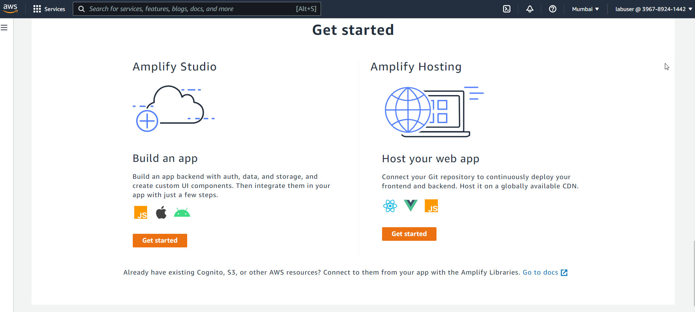

8) For the code repository select `GitHub` and click `Continue`. You need to login to your GitHub account and allow AWS to access the repositories. 

    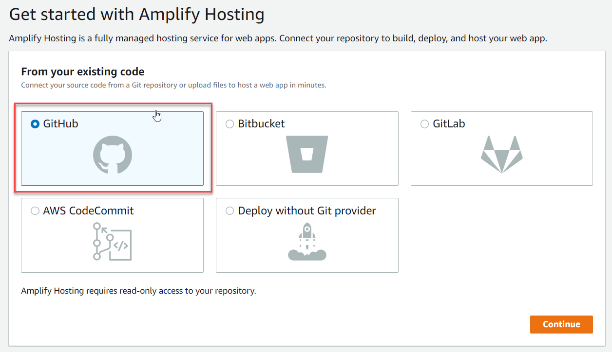

9) After the login is successfull, select the `employee-portal-ui` repository from the dropdown list and select `main` branch from Branch list. Click `Next` to continue.

     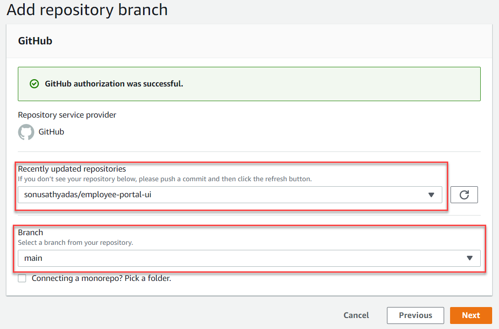

10) In the `Configure build settings` page, you can update the application name if you wish or leave it as default. Verify the build configuration YAML and click `Next`.

     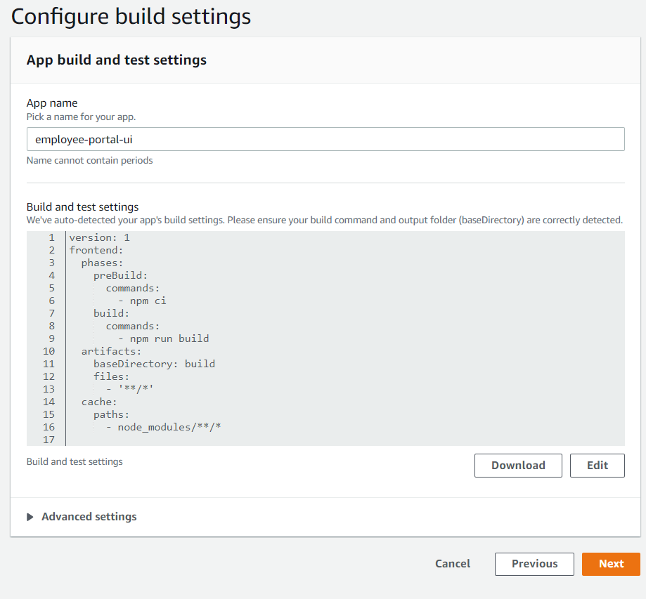

11) Review the configuration settings and click on `Save and Deploy`. This will start the deployment process of React frontend web application. You can see the progress of the build process. 

    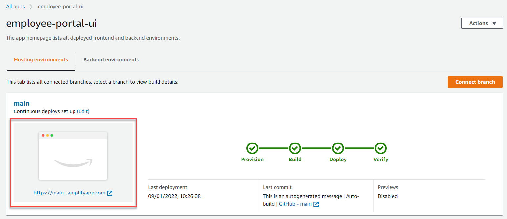

12) After the deployment is successfully completed click on the thumbnail on the left side or click on the URL to launch the application.
    
    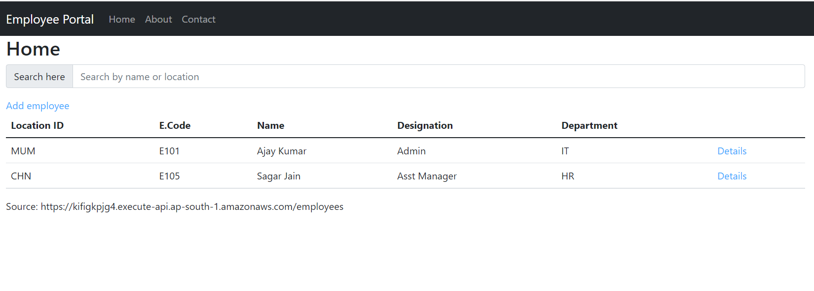

13) Your application is now successfully configured for CI/CD. Any code changes made on the code will be redeployed automatically when you push the code to the GitHub repository.
14) Open the project in Visual Studio Code and open  `src\components\Home.jsx` file. Update the page heading from `<h2>Home</2>` to `<h2>Employee List</h2>` inside the render method.
    ```javascript
    render() {
        return (
            <EmployeeContext.Provider value={{ employees: this.state.filteredResults, loadedAt: new Date(), doSearch: this.handleSearch }}>
                <Container>
                    <Row>
                        <Col><h2>Employee List</h2></Col>
                    </Row>
                    <Row>
                        <Col><SearchBar /></Col>
                    </Row>
                    <Row>
                        <Col>
                            <UserList /> 
                        </Col>
                    </Row>

                </Container>
            </EmployeeContext.Provider>
        );
    }
    ```

15) Save the changes and puh the code changes to GitHub repository.
    ```bash
    git add .
    git commit -m "heading updated"
    git push -u origin main
    ```

16) You can see the commit triggering the build process in Amplify console.
    
    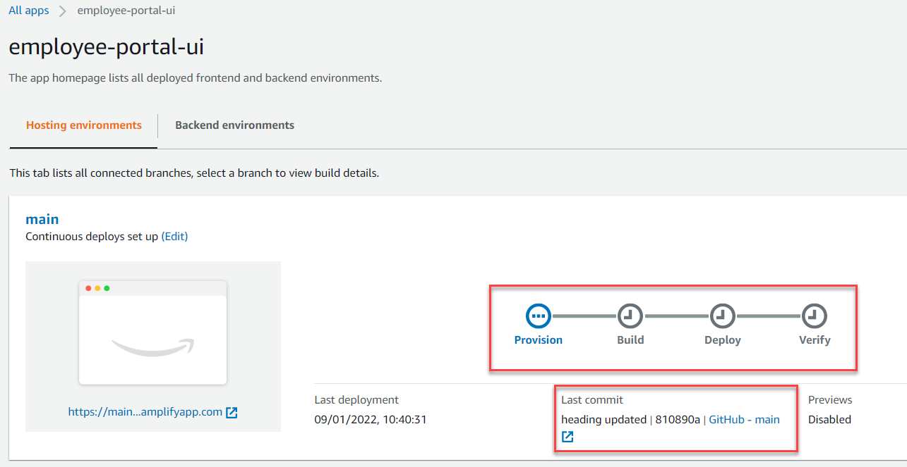

17) After the deployment is successfull, reload the application to see the changes. 

    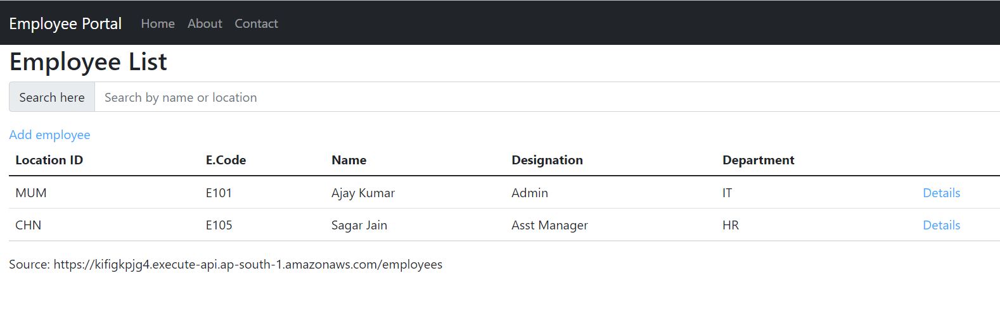

## Create a service role for AWS Amplify build process
You need to enable Amplify on your React project that helps you to add Cognito authentication. To build the backend services you need to create and configure a Service role for your Amplify project.

1) Open the AWS management console and search for `IAM`. Navigate to the IAM service console.
2) Click on the `Roles` link on the left pane to view the existing list of roles. Click on the `Create role` button to start creating a new Role.
3) Select `AWS Service`  and choose `Amplify` from the list of AWS Services. In the `Select your use case` section choose `Amplify - Backend Deployment` and click `Next:Permissions`.
4) In the policy section you can see the `AdministratorAccess-Amplify` policy selected by default. Click on the `Next:Tags`.
5) You can optionally provide the tags for your role. Click on the `Next:Review` button.
6) Specify the service role name as `AmplifyConsoleServiceRole-AmplifyRole` and click `Create role`.
7) Open you `employee-portal-ui` Amplify project in AWS management console. Under the `App settings` click on the `General` section.
8) Click on the `Edit` button to update the app details. For the Service role select the `AmplifyConsoleServiceRole-AmplifyRole` service role and click on `Save` button.

    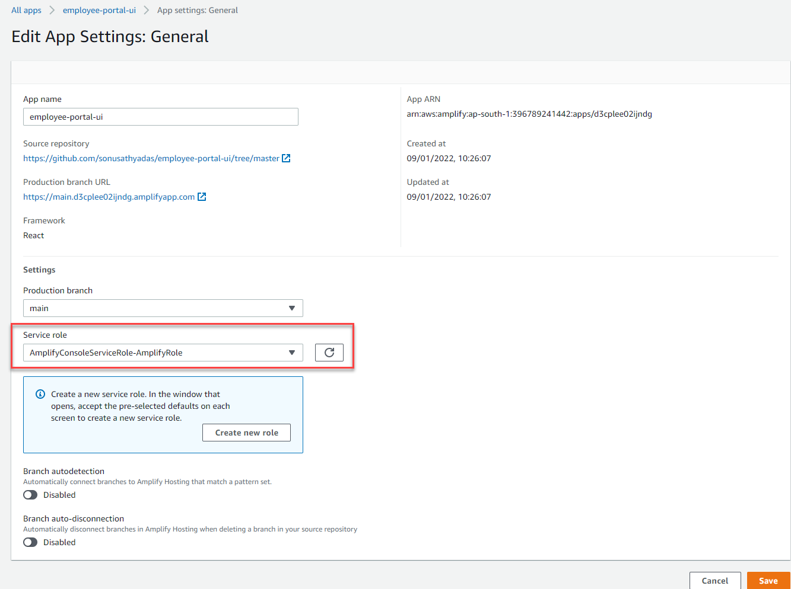

## Configure Amplify on React application locally
1) Open the Amplify project in AWS Amplify service console. click on `Backend environments` and click on `Get started`. Wait for the back end to be deployed.

    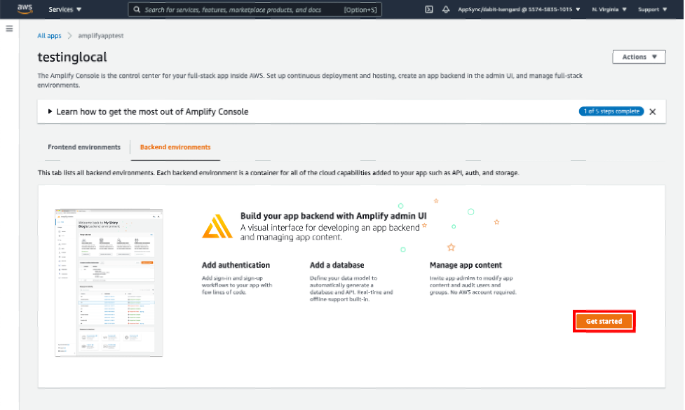

2) After the backend is provisioned successfully, click on the `Launch Studio` button to open the Amplify studio.

    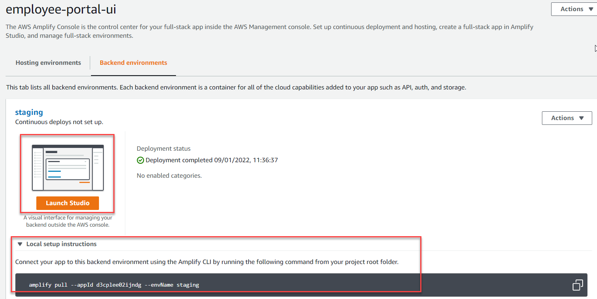

3) Go back to the Amplify Console Backend environments tab and open the Local setup instructions. Copy the command to your clipboard and open the terminal on your computer. Set the terminal path to the react application folder and run the command.
    ```bash
    amplify pull --appId d3cplee02ijndg --envName staging
    ```
4) You need to authenticate to AWS account. After the authentication is successful follow the instructions to configure the amplify in project.
    ```
    ? Choose your default editor: Visual Studio Code
    ? Choose the type of app that you're building javascript
    ? What javascript framework are you using react
    ? Source Directory Path:  src 
    ? Distribution Directory Path: build
    ? Build Command:  npm run-script build
    ? Start Command: npm run-script start
    ? Do you plan on modifying this backend? Y
    ````

## Enable authentication for React application using Cognito user pool
1) Open the React project in Visual Studio Code. Open the terminal and install the following npm packages to the project.
    ```bash
    npm install aws-amplify @aws-amplify/ui-react
    ```
    > [!IMPORTANT]
    > This will be installing the latest version of `@aws-amplify/ui-react` package. You need to update the amplify CLI in the Amplify management console to use the latest version for successfully building the project.

2) To enable the authentication service on the project run the following command. It will prompt for the authentication mode and sign in method.
    ```bash
    amplify add auth
    ```
    ```    
    ? Do you want to use the default authentication and security configuration? : Default configuration 
    ? How do you want users to be able to sign in? : Username
    ? Do you want to configure advanced settings? : No, I am done.
    ```

3) Now that the authentication service has been configured locally. Before you push the changes to AWS you can update the name of user pool and identity pool.It is optional to do this. To update the names of user pool and identitypool open the `amplify\backend\auth\<random-name>\cli-inputs.json` file and update the values for `identityPoolName` and `userPoolName` attributes.

    ```json
    {
      "version": "1",
      "cognitoConfig": {
        "identityPoolName": "employee_identitypool",
        "allowUnauthenticatedIdentities": false,
        "resourceNameTruncated": "employ8203a640",
        "userPoolName": "employee_userpool",
        "autoVerifiedAttributes": [
          "email"
        ],
    ......
    ```

4) Now we can deploy it by running the Amplify push command.
    ```bash
    amplify push --y
    ```

5) Open the `App.js` file in your react application and add the following code below all import statements
    ```javascript
    import { Amplify } from 'aws-amplify';
    import { Authenticator } from '@aws-amplify/ui-react';
    import '@aws-amplify/ui-react/styles.css';
    import awsExports from './aws-exports';
    Amplify.configure(awsExports);
    ```

6) Update the `App` component code with the following. This will add a signout link and shows currently logged in user name in the navigation bar.
    ```javascript
    function App({ loadEmployees }) {
        loadEmployees();
    
        return (
            <Authenticator loginMechanisms={['username']}>
                {({ signOut, user }) => (
                    <Router>
                        <Navbar bg="dark" variant="dark">
                            <Container>
                                <Navbar.Brand href="#home">{process.env.REACT_APP_APP_NAME}</Navbar.Brand>
                                <Nav className="me-auto">
                                    <Nav.Link as={Link} to="/" >Home</Nav.Link>
                                    <Nav.Link as={Link} to="/about">About</Nav.Link>
                                    <Nav.Link as={Link} to="/contact">Contact</Nav.Link>
                                    <Nav.Link onClick={signOut}>Sign out</Nav.Link>
                                    <Nav.Link href ="#" > Welcome {user.username}</Nav.Link> 
                                </Nav>
                            </Container>
                        </Navbar>
                        <div>
                            <Routes>
                                <Route exact path="/" element={<Home />}></Route>
                                <Route exact path="about" element={<About />}></Route>
                                <Route exact path="contact" element={<Contact />}></Route>
                                <Route exact path="employees/loc/:loc/code/:code" element={<EmployeeDetail />}></Route>
                                <Route exact path="employees/new" element={<EmployeeForm />} ></Route>
                                <Route path="*" element={<Navigate to="/" />} />
                            </Routes>
                        </div>
                    </Router>
                )}
            </Authenticator>
        );
    }
    ```

7) Now, you can test the applciation locally by running the following commnad.
    ```bash
    npm start
    ```

8) Applciation will launch with a login page, click on the `Create account` and create a new user account. You need to use a valid email id while registering new user. A verification code will be sent to specified email. 

    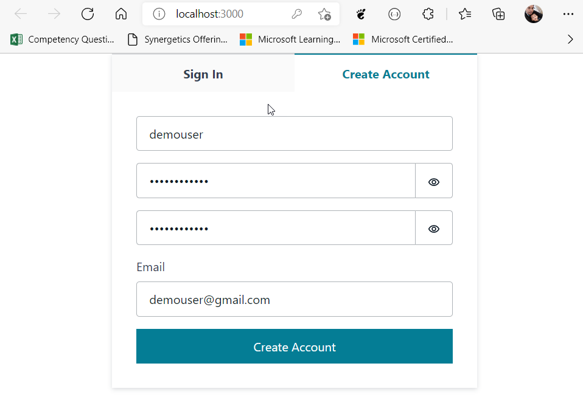

9) After you create the user successfully, you will be logged in automatically and redirected to applciation home page.

    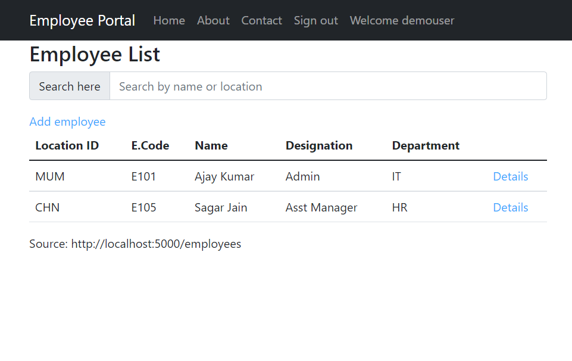

10) Next, we need to configure the Amplify build process to add the backend as part of the continuous deployment workflow. From your terminal window run the following command to open amplify console.
    ```bash
    amplify console
    ```
    ```bash
    Which site do you want to open? · Console
    ```

11) This will open the AWS console. Select the Amplify project and open **App Settings > Build Settings** page. Click on the `Edit` button to edit the `Amplify.yml` file. Add the following lines of code above the `frontend`.

    ```yml
    backend:
      phases:
        build:
          commands:
            - '# Execute Amplify CLI with the helper script'
            - amplifyPush --simple
    ```
    
    The complete YAML fiel looks like:
    ```yml
    version: 1
    backend:
      phases:
        build:
          commands:
            - '# Execute Amplify CLI with the helper script'
            - amplifyPush --simple
    frontend:
      phases:
        preBuild:
          commands:
            - npm ci
        build:
          commands:
            - npm run build
      artifacts:
        baseDirectory: build
        files:
          - '**/*'
      cache:
        paths:
          - node_modules/**/*
    
    ```
12) Also you need to update the Amplify CLI version to the latest in the build settings. This will override the default version of Amplify CLI in console with the latest version. In the **Build Settings** page scroll down to bottom and click on the `Edit` button for `Build image settings`. 

    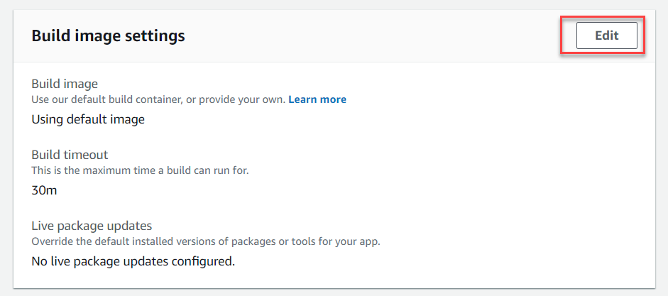

13) Click on the `Add package version override` and choose `Amplify CLI`. Make sure the `latest` is given as the value for version.

    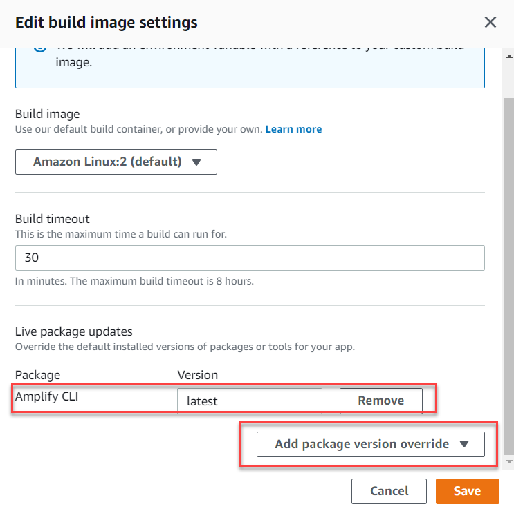

14) Next, update your front end branch to point to the backend environment you just created. Under the branch name, choose `Edit`.
    

15) In the `Edit target backend` dialog, point your frontend `main` branch to the backend you just created. Choose `Save`.

    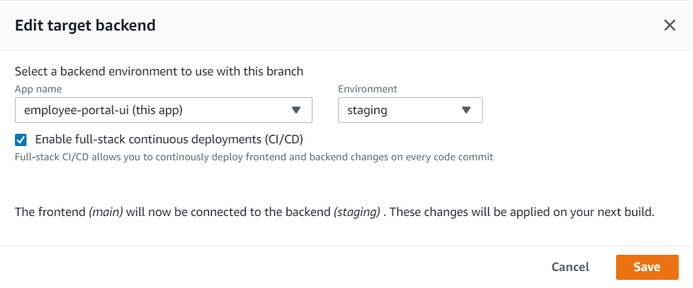

16) Go back to the terminal in your local machine and run the following commands to push the changes to the GitHub repository.
    ```bash
    git add .
    git commit -m “added auth”
    git push origin main
    ```
17) This will start the build and deploy process automatically. Wait for the build process to complete. Click on the frontend thumbnail or click on the Url to launch the application.

    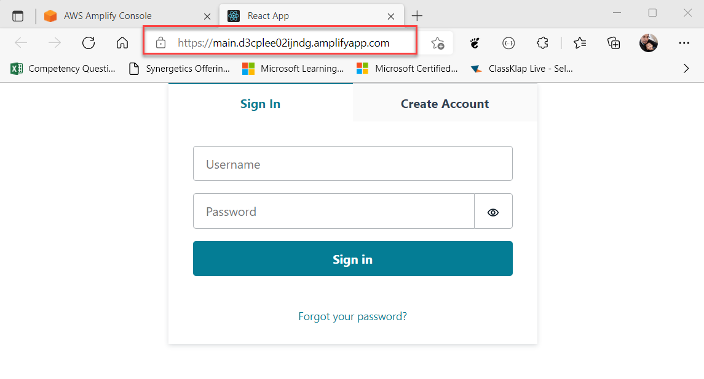

18) Login with the Cognito user account which you have registered earlier.
    
    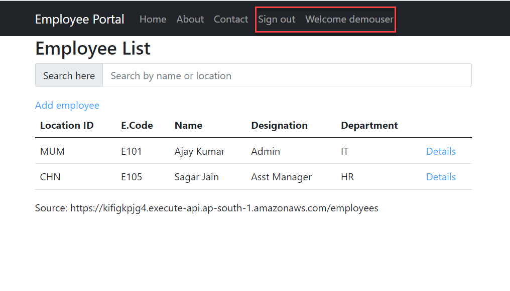
